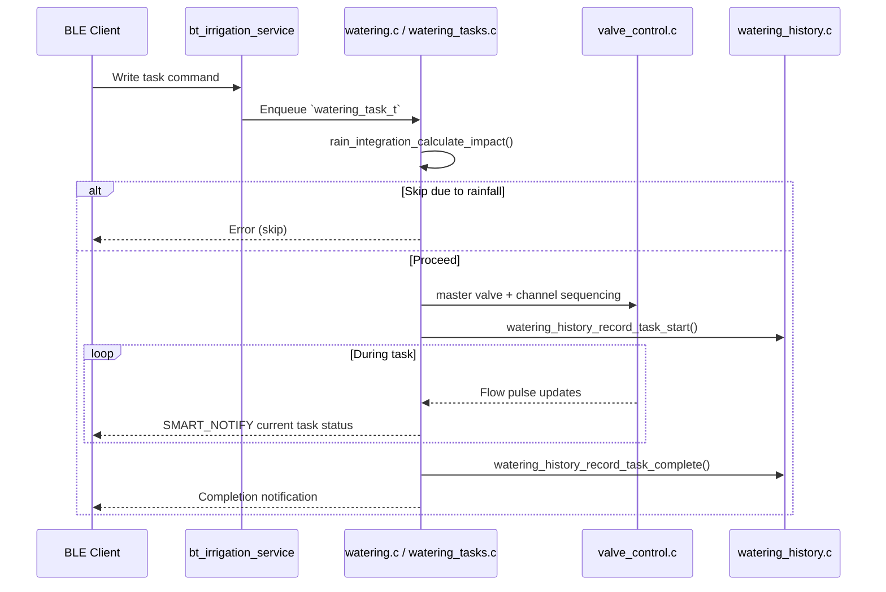
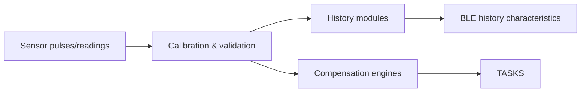

# AutoWatering System Architecture (October 2025)

AutoWatering is a Zephyr-based irrigation controller targeted at the nRF52840. This document maps the current firmware structure as validated in `src/main.c` and the associated modules.

## High-Level Stack

```mermaid
graph LR
    subgraph Client
        CLIENT[BLE client (mobile/desktop)]
    end
    subgraph Communication
        BLE[Zephyr BLE peripheral]
        FRAG[Fragmentation helpers]
        NOTIFY[Notification throttling]
    end
    subgraph Application
        TASKS[watering_tasks.c]
        AUTO[fao56_calc.c / watering.c]
        CFG[nvs_config.c]
        HIST[history modules]
    end
    subgraph Sensors & Drivers
        FLOW[flow_sensor.c]
        RAIN[rain_sensor.c]
        ENV[env_sensors.c]
        VALVE[valve_control.c]
        RTC[rtc.c]
    end
    CLIENT --> BLE
    BLE --> FRAG
    BLE --> NOTIFY
    FRAG --> TASKS
    NOTIFY --> TASKS
    TASKS --> VALVE
    TASKS --> HIST
    FLOW --> TASKS
    RAIN --> TASKS
    ENV --> AUTO
    AUTO --> TASKS
    AUTO --> HIST
    CFG --> TASKS
    CFG --> HIST
    RTC --> AUTO
```

## Boot & Initialization

`main.c` performs a deterministic start-up sequence:

1. USB CDC ACM (optional console) via `setup_usb_cdc_acm()`.
2. Persistent storage: `nvs_config_init()`.
3. Valve hardware (`valve_init()`), flow sensor, and rain sensor drivers.
4. RTC (`rtc_init()` with uptime fallback) and timezone helpers (UTC default with configurable offset/DST persisted via NVS).
5. Core watering engine: `watering_init()` followed by `watering_start_tasks()` (spawns processing threads and work items).
6. Support services: storage monitor, configuration status, onboarding state, reset controller, enhanced status/error handlers.
7. Sensor stack: `sensor_manager`, BME280 driver, environmental data + history modules.
8. Compensation layers: custom soil DB, rain compensation, temperature compensation & integration, interval task integration.
9. History subsystems: watering history, rain history, rain integration.
10. BLE service (`bt_irrigation_service_init()`) when `CONFIG_BT` is enabled.

All module initializations log warnings on failure but keep the system running unless NVS cannot be mounted.

## Runtime Components

### Watering Engine
- `watering_tasks_queue` (depth 10) feeds `watering_start_task()`; only one task is active at a time.
- Modes: duration, volume, automatic quality, automatic eco (70% reduction) with temperature compensation hooks.
- Interval mode support integrates through `interval_task_integration.c` and `interval_mode_controller.c`.
- Master valve sequencing and overlap handling implemented in `valve_control.c`.

### Scheduling & Automation
- Three schedule modes via `schedule_type_t`:
  - **SCHEDULE_DAILY (0)**: Runs on selected days via bitmask (e.g., Mon/Wed/Fri).
  - **SCHEDULE_PERIODIC (1)**: Runs every N days.
  - **SCHEDULE_AUTO (2)**: FAO-56 smart irrigation - checks soil water deficit daily, only irrigates when deficit ≥ RAW threshold. Requires plant_db_index, soil_db_index, and planting_date_unix to be configured.
- FAO-56 calculations executed on demand (`apply_quality_irrigation_mode`, `apply_eco_irrigation_mode`) with maximum volume limiting.
- AUTO mode (`fao56_daily_update_deficit`) evaluates deficit at configured time (e.g., 06:00), applies missed-day accumulation on power-up, and triggers volume-based irrigation when needed.
- Rain integration (`rain_integration_calculate_impact`) applies volume/time reductions or skips before tasks start.
- Temperature compensation adjusts FAO-56 outputs when enabled per channel (`temperature_compensation_integration.c`).

### Sensors & Telemetry
- Flow pulses captured via GPIO interrupts (`flow_sensor.c`) with calibration and no-flow/unexpected-flow alarms.
- Rain gauge pulses recorded with hourly/daily aggregates (`rain_sensor.c`, `rain_history.c`).
- Environmental snapshots collected from the BME280 (`env_sensors.c`, `environmental_history.c`).
- RTC access provided by `rtc.c` with uptime fallback when the DS3231 is unavailable.

### Persistence & Histories
- All writes/read flow through `nvs_config.c`; individual modules own their keys.
- `watering_history.c`: 30 detailed events/channel, 90 daily, 36 monthly, 10 annual summaries plus optional insights cache.
- `rain_history.c` and `environmental_history.c` maintain rolling datasets for BLE export.
- Generated databases (`plant_full_db.inc`, `soil_enhanced_db.inc`, `irrigation_methods_db.inc`) are included directly with compile-time size asserts.

### BLE Interface
- `bt_irrigation_service.c` exposes 33 characteristics (26 irrigation + 7 history) documented under `docs/ble-api/`.
- Notification macros (`SMART_NOTIFY`, `CRITICAL_NOTIFY`, `CHANNEL_CONFIG_NOTIFY`) enforce throttling tiers.
- Large payloads (channel config, histories) use the shared fragmentation helpers with 3-byte headers.
- History control/insights characteristics mirror the structures defined in the history modules; settings persist through NVS.

#### BLE Performance Optimizations (v3.1.0+)

**Connection-Level Optimizations:**
- **PHY 2M**: Automatically requested at connection for ~2x raw throughput (1 Mbps → 2 Mbps)
- **Data Length Extension (DLE)**: Requests 251-byte packets (may fail on some controllers, gracefully handled)
- **Buffer Configuration**: Increased TX/RX buffer counts for sustained throughput

**History Query Optimizations:**
- **Binary Search**: `history_flash_query_range()` uses O(log n) binary search instead of linear scan
- **Early Exit**: Range queries stop immediately when timestamp exceeds end boundary
- **Transfer Caching**: 30-second cache for `g_transfer` avoids re-reading flash between fragments

**Fragment Streaming Optimizations:**
- **Reduced Delays**: Inter-fragment delay reduced from 5ms to 2ms
- **Retry Logic**: Exponential backoff (20ms → 640ms, 5 retries) in all fragment work handlers
- **Rate-Limit Bypass**: Sequential fragment requests bypass the 100ms rate-limit check

**Bulk Sync Snapshot (UUID 0xde60):**
- Single 60-byte READ replaces 10+ individual queries at connection
- Contains: system status, environmental data, rain totals, compensation, channel states
- Reduces initial sync latency from ~500ms to ~50ms

#### BLE Notification Priority System
- **Priority Classes**:
  - `NOTIFY_PRIORITY_CRITICAL` (0ms): Alarms, errors - immediate delivery.
  - `NOTIFY_PRIORITY_HIGH` (50ms): Status updates, valve changes.
  - `NOTIFY_PRIORITY_NORMAL` (200ms): Flow data, statistics.
  - `NOTIFY_PRIORITY_LOW` (1000ms): History, diagnostics.
- **Mechanism**: `safe_notify` (aliased to `advanced_notify`) uses a buffer pool (`BLE_BUFFER_POOL_SIZE=8`) and adaptive throttling.
- **Macros**: `SMART_NOTIFY` handles standard throttling, `CRITICAL_NOTIFY` bypasses checks for urgent alerts, `CHANNEL_CONFIG_NOTIFY` handles name change throttling.

### Diagnostics & Power
- Status codes (`WATERING_STATUS_*`) published via BLE and logs; leak detection relies on flow anomaly detection.
- Power modes (`POWER_MODE_NORMAL`, `POWER_MODE_ENERGY_SAVING`, `POWER_MODE_ULTRA_LOW_POWER`) adjust sleep intervals inside monitoring loops.
- Enhanced error handling and reset controller modules centralize fault logging and recovery entry points.
- Periodic memory statistics logged from the idle loop every 10 minutes.

## Threading Model

- Watering processing relies on Zephyr work queue callbacks plus the message queue for tasks.
- Flow and rain sensors use interrupt callbacks with minimal work handler scheduling.
- History garbage collection runs in a dedicated thread (`watering_history.c`).
- BLE host/controller threads follow Zephyr defaults; stack sizes are increased in `prj.conf` to handle fragmentation workloads.

## Data & Control Flows

### Task Lifecycle



### Sensor Data Pipeline



## Known Limits

- 8 irrigation channels; concurrency is single-task by design.
- One BLE connection at a time (`CONFIG_BT_MAX_CONN=1`).
- Plant database holds 223 entries (44-byte structs).
- History retention: detailed last 30 events/channel, daily 90 days, monthly 36 months, annual 10 years.
- Insights data exists but requires external producers (`history_insights_update`).
- PHY 2M requires central support; DLE may fail on some BLE controllers (error -13 is normal).
- Binary search assumes monotonically increasing timestamps in flash history files.

## Open Follow-Ups

- Automated generation of insights and advanced analytics is pending.
- Rain skip currently returns `WATERING_ERROR_BUSY`; explicit "skipped" history logging may be desirable.
- External weather ingestion, secure boot, and OTA update paths remain deferred (see `docs/CHANGELOG.md`).

This architecture description reflects only modules and flows present in the repository as of October 2025, reducing drift between documentation and firmware behavior.
